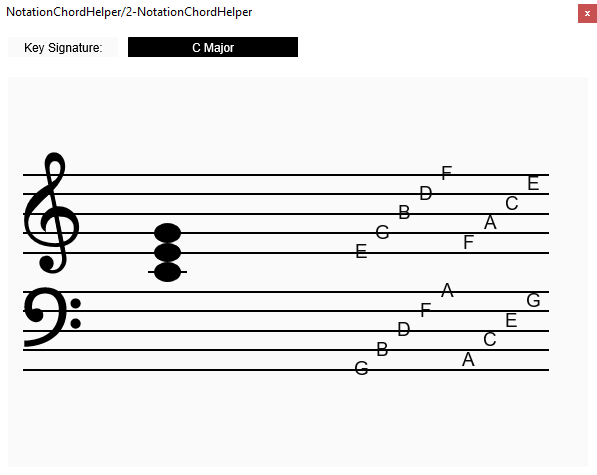

# NotationChordHelper VST3 Plugin

A VST3 plugin for displaying musical notation and chord analysis.



## Features

- VST3 compatible plugin
- Cross-platform support (Windows and macOS)
- Built with the VST3 SDK

## Building from Source

### Prerequisites

- CMake 3.14.0 or higher
- C++ compiler with C++17 support
- Git

### Build Instructions

1. Clone the repository:
   ```bash
   git clone https://github.com/ursulean/NotationChordHelper.git
   cd NotationChordHelper
   ```

2. Build the project:
   ```bash
   # macOS/Linux
   ./build.sh
   ```

   ```
   # Windows
   .\build.bat
   ```

The VST3 SDK will be automatically downloaded during the build process.

## Installation

### Windows
Copy the `NotationChordHelper.vst3` folder to your VST3 plugins directory:
- `C:\Program Files\Common Files\VST3\` (system-wide)
- Or your DAW's VST3 folder

### macOS
Copy the `NotationChordHelper.vst3` bundle to your VST3 plugins directory:
- `/Library/Audio/Plug-Ins/VST3/` (system-wide)
- Or your DAW's VST3 folder

## Releases

Pre-compiled `.vst3` files are available in the [Releases](https://github.com/ursulean/NotationChordHelper/releases) section.

### Latest Release
- **Windows**: Download `NotationChordHelper.vst3` from the latest release
- **macOS**: Download `NotationChordHelper.vst3` from the latest release

## Development

### Project Structure
```
NotationChordHelper/
├── source/           # Source code
├── resource/         # Plugin resources
├── external/         # External dependencies (VST3 SDK)
├── .github/          # GitHub Actions workflows
└── CMakeLists.txt    # Build configuration
```

### Automated Builds

This project uses GitHub Actions for automated builds:
- **Build Test**: Runs on every push and pull request to verify builds work
- **Release**: Automatically creates releases with compiled `.vst3` files when you push a version tag

### Creating a Release

1. Update the version in `CMakeLists.txt` if needed
2. Commit your changes
3. Create and push a version tag:
   ```bash
   git tag v1.0.0
   git push origin v1.0.0
   ```
4. GitHub Actions will automatically build and create a release with the compiled `.vst3` files

## License

[Add your license information here]

## Contributing

[Add contribution guidelines here]
